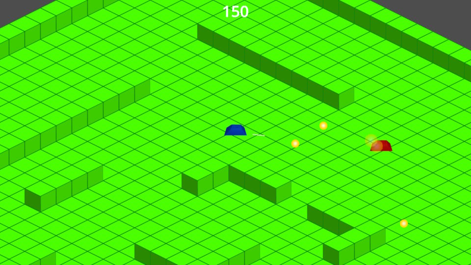

# generic-twin-stick-shooter
Basic twin stick shooter based on [`Godot 4.4.1'](https://godotengine.org/).
This is no complete game. Just a PoC to test how an isometric game could work with Godot.

Isometric level uses ['TileMapLayer'](https://docs.godotengine.org/en/stable/classes/class_tilemaplayer.html).
['CharacterBody2D'](https://docs.godotengine.org/en/stable/classes/class_characterbody2d.html) is used for the moving entites for easy movement and collision detection.
Triple A assets ;) are created with ['Blender'](https://www.blender.org) and [paint.net](https://www.getpaint.net/).
Sounds are generated with ['sfxr'](https://www.drpetter.se/project_sfxr.html).
